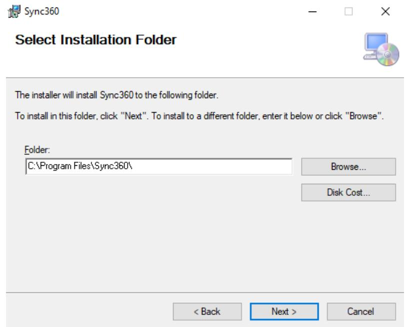
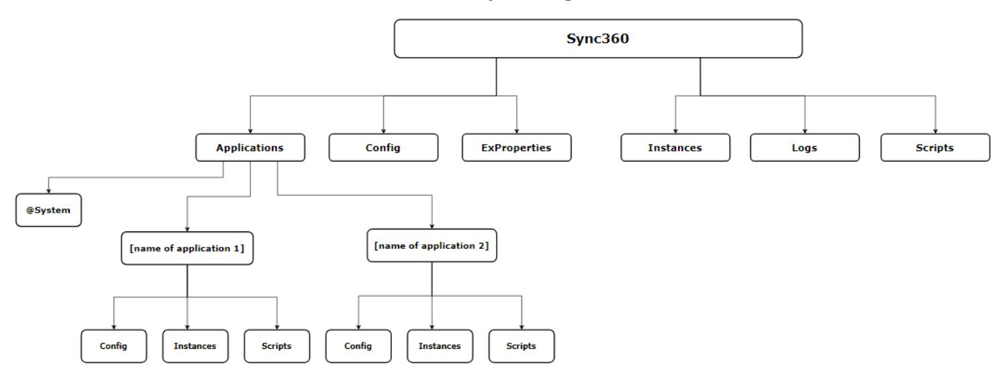
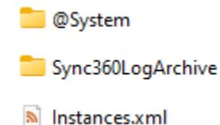
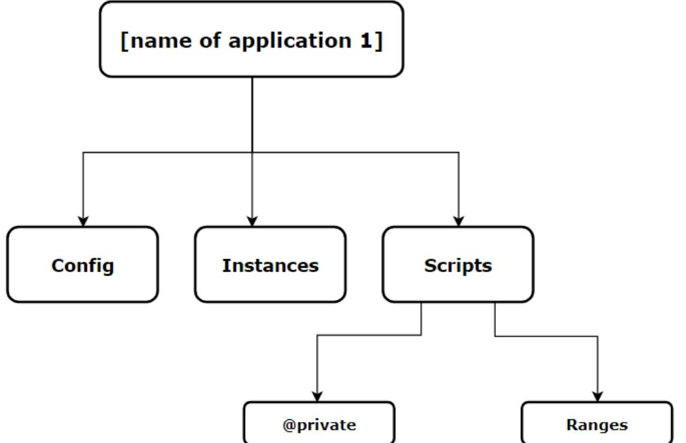

Hso | the results company

**Prepared By:**

AN

### Sync360 Installation and Administration Guide

v.1.1.3 (241022)

This document and its supporting materials are proprietary and confidential. The information may not be disclosed to a third party without the express permission of HSO.


#### **Contributors**

| Name    | Roman Rudenko     |
|---------|-------------------|
| Role    |                   |
| Company |                   |
| Name    | Alexandra Petrova |
| Role    |                   |
| Company |                   |
| Name    | Alexander Novikov |
| Role    |                   |
| Company |                   |

#### **Document Revision History**

**NOTE:** This section contains only content changes made to the document. Solution changes have been moved to the [Release Notes](#page-30-0) section and are now located at the bottom of the document.

| <b>Version</b> | <b>Section</b>                                  | <b>Content Change</b>                                                                                                                                                                                                                                                    | <b>Date</b> |
|----------------|-------------------------------------------------|--------------------------------------------------------------------------------------------------------------------------------------------------------------------------------------------------------------------------------------------------------------------------|-------------|
| 1.1.3 (241022) | <b>UPDATE</b>                                   |                                                                                                                                                                                                                                                                          | 06/23/25    |
|                | Sync360<br>Service<br>Configuration             | Renamed Sync360 Service Recovery<br>$\bullet$<br>Configuration to Sync360 Service Configuration<br>Added description for service account used to<br>$\bullet$<br>run the sync360 service.<br>Moved Sync360 Service Recovery Configuration<br>$\bullet$<br>to subsection. |             |
| 1.1.2 (241022) | <b>UPDATE</b>                                   |                                                                                                                                                                                                                                                                          | 01/28/25    |
|                | Release<br><b>Notes</b>                         | Updated version 241022<br>$\bullet$                                                                                                                                                                                                                                      |             |
| 1.1.1 (241022) | <b>UPDATE</b>                                   |                                                                                                                                                                                                                                                                          | 10/24/2024  |
|                | Release<br><b>Notes</b>                         | Added versions 241022, 240614<br>$\bullet$                                                                                                                                                                                                                               |             |
| 1.1 (231130)   | <b>NEW</b>                                      |                                                                                                                                                                                                                                                                          | 07/10/2024  |
|                | Appendix                                        | Created the Appendix section.<br>$\bullet$<br>Created the Release Notes section within<br>Appendix.                                                                                                                                                                      |             |
|                | Document<br>Information                         | Created the Document Information section.<br>$\bullet$                                                                                                                                                                                                                   |             |
|                | Systems<br>Interface<br>Details                 | Created the Systems Interface Details section.<br>$\bullet$<br>Added the System interface diagram.<br>$\bullet$                                                                                                                                                          |             |
|                | Sync360<br>Service<br>Recovery<br>Configuration | Created the Sync360 Service Recovery<br>$\bullet$<br>Configuration section.<br>Added the Service recovery configuration<br>$\bullet$<br>settings.                                                                                                                        |             |
|                | <b>UPDATE</b>                                   |                                                                                                                                                                                                                                                                          |             |
|                | Document<br>Revision<br>History                 | Changed the name of the section from 'Revision<br>$\bullet$<br>History' to 'Document Revision History'.<br>Added a note.<br>$\bullet$                                                                                                                                    |             |

| Version | Section       | Content Change                                                                                                               | Date       |            |
|---------|---------------|------------------------------------------------------------------------------------------------------------------------------|------------|------------|
|         |               | Changed the structure of the section.                                                                                        |            |            |
|         | Release       | Moved description of solution changes to the<br>$\bullet$                                                                    |            |            |
|         | Notes         | Release Notes section.                                                                                                       |            |            |
|         | Requirements  | Added the latest OS requirements.                                                                                            |            |            |
| 1.0     | <b>NEW</b>    |                                                                                                                              | 09/13/2023 |            |
|         | All sections  | Document structure rewritten; structure schemes added; descriptions are now based on the current default version of Sync360. |            |            |
|         | Application   | Described scheduling methods and object processing feature.                                                                  |            |            |
|         | Structure     |                                                                                                                              |            |            |
| 0.5     | <b>UPDATE</b> |                                                                                                                              | 10/01/2021 |            |
| 0.4     | <b>NEW</b>    |                                                                                                                              |            |            |
|         |               | Added the Encryption note.                                                                                                   |            |            |
| 0.2     | <b>NEW</b>    |                                                                                                                              |            | 05/23/2017 |
|         | All sections  | Second Version of the document was prepared.                                                                                 |            |            |
| 0.1     | <b>NEW</b>    |                                                                                                                              | 03/28/2014 |            |
|         | All sections  | First Version of the document was prepared.                                                                                  |            |            |

the results company

**Hso** 


## Document Information

#### **Audience**

This document is intended for HSO developers. This may be forwarded to responsible employees on the client's side as appropriate.

#### **Purpose**

Provide guidance on installation and administration of Sync360 Engine, its configuration, structure, and interface.


## **Table of Contents**

| Introduction ……………………………………………………………………………………………… |
|---------------------------------------------------|
| Requirements                                      |
| Hardware Requirements                             |
| Software Requirements                             |
| Network Requirements                              |
| Systems Interface Details                         |
| 10                                                |
| Installation via Graphic Interface                |
| Installation via Command Line                     |
| Default Installation                              |
| Installation with Arguments                       |
| Sync360 Service Configuration                     |
| Sync360 Service Recovery Configuration            |
| Update                                            |
| 81.                                               |
| Sync360 Folder                                    |
| Config Folder                                     |
| Applications Folder                               |
| Scripts Folder                                    |
| Application Structure                             |
| Config Folder                                     |
| Instances Folder                                  |
| Scripts Folder                                    |
| Execution                                         |
| Using Engine                                      |
| Appendix                                          |
| Release Notes                                     |


### <span id="page-5-0"></span>INTRODUCTION

This document describes the installation process, structure, configuration, and execution of the Sync360 engine.


### <span id="page-6-0"></span>REQUIREMENTS

### <span id="page-6-1"></span>Hardware Requirements

#### Minimum hardware requirements:

| <b>Components</b> | <b>Requirements</b>                    |
|-------------------|----------------------------------------|
| Processor         | Dual core processor or 2 virtual cores |
| Memory            | 8 GB RAM or more                       |
| Hard Disk         | 1 GB of available hard disk space      |

Recommended hardware requirements:

| <b>Components</b> | <b>Requirements</b>                |
|-------------------|------------------------------------|
| Processor         | 4 core processor (2.8 GHz)         |
| Memory            | 16 GB RAM or more                  |
| Hard Disk         | 60 GB of available hard disk space |

**NOTE:** Actual hardware requirements may vary based on your specific integration requirements. The number and frequency of integrations can cause the processor and memory requirements to increase.

**NOTE:** In case your company operates large volumes of data, it is recommended to use four processors instead of two

### <span id="page-6-2"></span>Software Requirements

| <b>Components</b>       | <b>Requirements</b>                                                                                                                                                    |
|-------------------------|------------------------------------------------------------------------------------------------------------------------------------------------------------------------|
| <b>Operating System</b> | <b>Windows Server 2022</b>                                                                                                                                             |
| (Recommended versions)  | Desktop Experience must be enabled. It is not enabled by default.<br>٠<br>.Net framework is loaded automatically, so there's no need to install<br>٠<br>it separately. |
|                         | <b>Windows Server 2019</b>                                                                                                                                             |
|                         | Desktop Experience must be enabled. It is not enabled by default.                                                                                                      |
|                         | Windows Server 2012 / 2012 R2 / 2016                                                                                                                                   |
| <b>Operating System</b> | Windows 10 (64-bit)                                                                                                                                                    |
| (Other versions)        | Windows 8.1 (64-bit)                                                                                                                                                   |
|                         | Windows 7 (64-bit)                                                                                                                                                     |
| .NET                    | Microsoft .NET Framework 4.6.2                                                                                                                                         |
| <b>Windows Features</b> | Windows Identity Foundation (Only for connection to Dynamics CRM<br>On-Premise)                                                                                        |

The following table lists the software requirements:

<span id="page-7-1"></span>Systems Interface Details

#### Office 365 ⊞ **Dataverse Your Tenant OAuth** Office 365 sync<sup>360</sup> **OAuth** sync360 **Dataverse** Configurations 88 Log Files $\bullet$ og Files **Process Manager RAM RAM** port **SQL Staging Instance 2 Instance 1 Workday HR DB Processing jobs** Processing jobs port 1433 **Processor BvD Aderant or Or 3E/Elite D&B** Job 80 or 443 **Provider** on-premise **Get jobs** Get jobs

**Hso** 

### Sync360 Installation and Administration Guide

<span id="page-7-0"></span>

The only network requirements are to make sure that the users who will be configuring / testing the Sync360 integration scripts and the service account used to start the Sync360 service have the ability to access any network resources / applications required for integration with the Sync360 server. This includes file shares, databases, clouds apps (Dynamics CRM Online), etc.


### <span id="page-8-0"></span>INSTALLATION

### <span id="page-8-1"></span>Installation via Graphic Interface

a na

Sync360 engine is shipped with one file of **.msi** extension. The installation is straightforward.

1. Navigate to your Sync360 .msi file and execute it. Example, *Sync360\_220804.msi*

**Color** 

2. On the welcome screen click **Next**. de Sync360  $\Box$  $\times$  $\cdots$  $\frac{1}{2}$ 

| Welcome to the Sync360 Setup Wizard                                                                                                                                                                                                                                                                            |      |        |
|----------------------------------------------------------------------------------------------------------------------------------------------------------------------------------------------------------------------------------------------------------------------------------------------------------------|------|--------|
| <b>The installer will guide you through the steps required to install Sync360 on your computer.</b>                                                                                                                                                                                                            |      |        |
| <i>WARNING: This computer program is protected by copyright law and international treaties.<br/>Unauthorized duplication or distribution of this program, or any portion of it, may result in severe civil<br/>or criminal penalties, and will be prosecuted to the maximum extent possible under the law.</i> |      |        |
| <b>8</b> Back                                                                                                                                                                                                                                                                                                  | Next | Cancel |

3. Specify installation folder or use the default one. We recommend installing to the default folder. Click **Next**.



| <b>HSO</b><br>Sync360 Installation and Administration Guide    |  |
|----------------------------------------------------------------|--|
| 4. On the next screen click <b>Next</b> to begin installation. |  |
| <b>Confirm Installation</b>                                    |  |
| The installer is ready to install Sync360 on your computer.    |  |
| Click "Next" to start the installation.                        |  |
|                                                                |  |
|                                                                |  |
|                                                                |  |
|                                                                |  |
|                                                                |  |
|                                                                |  |
| $<$ Back<br>Next<br>Cancel                                     |  |

5. During installation, the dialog will be displayed asking you to specify location for Log files and the Applications files root directory. Use the default or change it to any other. Besides, we recommend leaving the NTFS compression setting enabled. Click **OK** to continue. Use4si Processing Service installation: Set log directory  $\times$ 

| <b>Log directory:</b>                                                 | C:\Program Files\Sync360\Logs | Select |
|-----------------------------------------------------------------------|-------------------------------|--------|
| ○ Apply NTFS compression for Log directory, subdirectories and files. |                               |        |
| <b>Root directory:</b>                                                | C:\Program Files\Sync360      | Select |
| <b>Ok</b>                                                             |                               |        |

**NOTE:** Regardless of where you specify the Root and Log directories, you will need to grant the users who need to maintain and troubleshoot the Sync360 scripts full access to these folders (read, write, create, delete).

This is especially true if you choose the default folders. This is due to local admin rights are required to modify files in the Program Files folder. It will be the best practice to create a group for Sync360 administrators, add users to this group, and grant the group the necessary access to these folders.

| <b>Hso</b><br>Sync360 Installation and Administration Guide                        |  |
|------------------------------------------------------------------------------------|--|
| the results company                                                                |  |
| 6. After installation has finished, click <b>Close</b> to exit the wizard.         |  |
| esync360<br>$\times$<br>$\Box$                                                     |  |
| <b>Installation Complete</b>                                                       |  |
| Sync360 has been successfully installed.                                           |  |
| Click "Close" to exit.                                                             |  |
| Please use Windows Update to check for any critical updates to the .NET Framework. |  |
| $<$ Back<br>Cancel<br>Close                                                        |  |

### <span id="page-10-0"></span>Installation via Command Line

#### <span id="page-10-1"></span>Default Installation

Installation via Command Line is faster and more convenient in some cases. It can also be performed in a silent mode.

- 1. Launch your Command Line application, e. g. *Windows PowerShell*.
- 2. To perform default and silent installation simply enter the following command and execute it:  $\overline{S}$

| <b>Command:</b>              | $\texttt{SUALC-FLOCESS}$ installed.exe $\texttt{-MUUHEIULISU}$ /1 {pacificolitient]                     |
|------------------------------|---------------------------------------------------------------------------------------------------------|
|                              | <b>NOTE:</b> Where {path to installer} is a path to the Sync360 .msi file.                              |
| <b>2 Windows PowerShell:</b> |                                                                                                         |
| Command                      | > Start-Process msiexec.exe -Wait -ArgumentList '/I C:\Downloads\Sync360 220804.msi /q'<br>PS C:\Users\ |

3. After that, Sync360 will be installed into the default directory and no notifications will appear after installation will be completed.

٦

#### the results company

**Hso** 

#### <span id="page-11-0"></span>Installation with Arguments

If you need to specify application or log directories or disable NTFS log compression, use the argument examples listed below, and change their values according to your preferences.

- Application directory location: ApplicationsFolder="C:\Program Files\Sync360"
- Log directory location: LogsFolder="C:\Program Files\Sync360\Logs"
- NTFS compression for Log directory: LogsFolderCompression="True"

If all arguments have been added, the command will look similar to the example below.

X Windows PowerShell  $\Box$  $\times$ PS C:\Users\ > Start-Process msiexec.exe -Wait -ArgumentList


### <span id="page-12-0"></span>SYNC360 SERVICE CONFIGURATION

By default, the service is configured to run under local service account. Depending on requirements, a service might be required to run under domain service account. It is important to keep that in mind during sync360 upgrades and restore the configuration after each update. Use4si.ProcessingService Properties (Local Computer)

| General               |                        |                                              |
|-----------------------|------------------------|----------------------------------------------|
| Log On                |                        |                                              |
| Recovery Dependencies |                        |                                              |
| Log on as:            |                        |                                              |
|                       | ◉ Local System account | Allow service to interact with desktop       |
|                       | ◉ This account:        | serviceaccount@clientdomain<br><b>Browse</b> |
| Password:             |                        |                                              |
| Confirm password:     |                        |                                              |

### <span id="page-12-1"></span>Sync360 Service Recovery Configuration

It is recommended to configure service auto restart in case of failure.

| Use4si.ProcessingService Properties (Local Computer) |                                                                               |  |
|------------------------------------------------------|-------------------------------------------------------------------------------|--|
| <b>Recovery<br/>Log On<br/>General</b>               | <b>Dependencies</b>                                                           |  |
| <b>Actions.</b>                                      | Select the computer's response if this service fails. Help me set up recovery |  |
| First failure:                                       | <b>Restart the Service</b><br>✓                                               |  |
| Second failure:                                      | <b>Restart the Service</b><br>✓                                               |  |
| Subsequent failures:                                 | <b>Rerun the Service</b>                                                      |  |
| Reset fail count after:                              | 0<br>days                                                                     |  |
| Restart service after:                               | 5<br>minutes                                                                  |  |


### <span id="page-13-0"></span>UPDATE

**CAUTION:** To update Sync360 1.24.0410 or newer, follow the standard installation procedure. For more info on installation, please refer to 'Installation via Graphic Interface'. We recommend creating backups before every update.

Unlike clean installation, update to version 1.24.0410 or newer from the old version of Sync360 requires manual actions. To update, do the following:

- 1. In your Windows Server system, navigate to the folder where Sync360 is currently installed, e.g. …\Program Files\Sync360
- 2. Backup the contents of the Sync360 folder.

| Program Files ><br>Sync $360$ >       |                  |                    | $\checkmark$ | U             |
|---------------------------------------|------------------|--------------------|--------------|---------------|
| $\mathcal{P}_{\mathcal{N}}$<br>Name   | Date modified    | Type               | Size         |               |
| <b>Applications</b>                   | 15.04.2024 15:25 | File folder        |              |               |
| Config                                | 15:04:2024 15:25 | File folder        |              |               |
| <b>ExProperties</b>                   | 15:04:2024 15:25 | File folder        |              |               |
| Instances                             | 15:04:2024 15:25 | File folder        |              |               |
| Libraries                             | 18.03.2024 20:05 | File folder        |              |               |
| <b>Logs</b>                           | 15:04:2024 0:03  | File folder        |              |               |
| <b>Resources</b>                      | 15:04:2024 15:25 | File folder        |              |               |
| <b>Scripts</b>                        | 15.04.2024 15:25 | File folder        |              |               |
| AutoCompleteSettings.xml              | 17.02.2023 16:53 | XML File           |              | 8 KB          |
| Azure.Core.dll<br>ы                   | 04.11.2021 0:58  | Application extens |              | 225 KB        |
| Azure.Identity.dll<br>ы               | 14.10.2021 15:34 | Application extens |              | <b>288 KB</b> |
| Azure.Storage.Blobs.dll<br>ΙoΙ        | 09.09.2021 0:13  | Application extens |              | 1 036 KB      |
| Azure.Storage.Common.dll<br>N         | 09.09.2021 0:12  | Application extens |              | 86 KB         |
| Azure.Storage.Files.DataLake.dll<br>N | 09.09.2021 0:13  | Application extens |              | 535 KB        |
| BAC Use4si.Exchange.dil<br>m          | 04.12.2023 21:13 | Application extens |              | 1099 KB       |
| N<br><b>BST.dll</b>                   | 17.02.2023 16:53 | Application extens |              | 425 KB        |
| Castle.Core.dll<br>la)                | 20.06.2018 16:07 | Application extens |              | 425 KB        |

↓

| Sync360 $\rightarrow$<br>240415 ><br>backup > | $\mathcal{N}$<br>Name | Date modified      | Type    | Size |
|-----------------------------------------------|-----------------------|--------------------|---------|------|
| Applications                                  | 15.04.2024 15:27      | File folder        |         |      |
| Config                                        | 15.04.2024 15:27      | File folder        |         |      |
| <b>ExProperties</b>                           | 15.04.2024 15:27      | File folder        |         |      |
| Instances                                     | 15.04.2024 15:27      | File folder        |         |      |
| Libranes                                      | 15.04.2024 15:27      | File folder        |         |      |
| <b>Resources</b>                              | 15.04.2024 15:27      | File folder        |         |      |
| <b>Scripts</b>                                | 15.04.2024 15:27      | File folder        |         |      |
| AutoCompleteSettings.xml                      | 17.02.2023 16:53      | XML File           | 8 KB    |      |
| Azure Core dll<br>hal                         | 04.11.2021 0:58       | Application extens | 225 KB  |      |
| Azure.Identity.dll<br>юI                      | 14.10.2021 15:34      | Application extens | 288 KB  |      |
| Azure.Storage.Blobs.dll<br>m                  | 09.09.2021 0:13       | Application extens | 36 KB   |      |
| 岡<br>Azure.Storage.Common.dll                 | 09.09.2021 0:12       | Application extens | 86 KB   |      |
| Azure.Storage.Files.DataLake.dll<br>邰         | 09.09.2021 0:13       | Application extens | 535 KB  |      |
| BAC_Use4si.Exchange.dll<br>kaž                | 04.12.2023 21:13      | Application extens | 1099 KB |      |
| <b>BST.dil</b>                                | 17.02.2023 16:53      | Application extens | 425 KB  |      |
| Castle.Core.dll<br>hЮ                         | 20.06.2018 16:07      | Application extens | 425 KB  |      |

**NOTE:** 'Logs' folder usually takes up a lot of space, so you would want to evaluate whether you need to back it up or not.


3. Navigate to 'Settings'  $\rightarrow$  'Apps & Features' and uninstall Sync360.

| Settings               |                                                                                                            |
|------------------------|------------------------------------------------------------------------------------------------------------|
| Home<br>⋒              | Apps & features                                                                                            |
| Find a setting         | Choose where to get apps<br>$\mathcal{L}$                                                                  |
| Apps                   | Installing apps only from Microsoft Store helps protect your device.                                       |
| IΕ<br>Apps & features  | Anywhere<br>$\checkmark$                                                                                   |
| Б<br>Default apps      | Apps & features                                                                                            |
| Offline maps<br>吅      | Optional features                                                                                          |
| Apps for websites<br>回 | App execution aliases                                                                                      |
| Video playback<br>ū    | Search, sort, and filter by drive. If you would like to uninstall or move an app, select it from the list. |
| 무<br>Startup           | ø<br>sync                                                                                                  |
|                        | Sort by: Name $\vee$<br>Filter by: All drives $\vee$<br>1 app found                                        |
|                        | Sync360<br>49,2 MB<br>ı.<br>04.12.2023<br>1.23.1204                                                        |
|                        | Modify<br><b>Uninstall</b>                                                                                 |

- 4. Navigate back to the Sync360 folder and manually delete the following files from that folder:
  - o Use4si.Develop.exe
  - o Use4si.ProcessingService.exe
  - o Use4si.WorkerProcess.exe
  - o Use4si.Develop.exe.config
  - o Use4si.ProcessingService.exe.config
  - o Use4si.WorkerProcess.exe.config
  - o Use4si.ProcessingService.InstallState

| Program Files<br>Sync360            | Name             | Date modified         | Type    | Size |
|-------------------------------------|------------------|-----------------------|---------|------|
| $\hat{\phantom{a}}$<br>Applications | 15.04.2024 15:28 | File Folder           |         |      |
| Config                              | 15.04.2024 15:28 | File Folder           |         |      |
| <b>ExProperties</b>                 | 15.04.2024 15:28 | File Folder           |         |      |
| Instances                           | 15.04.2024 15:28 | File Folder           |         |      |
| Libraries                           | 18.03.2024 20:05 | File Folder           |         |      |
| Logs                                | 15.04.2024 00:03 | File Folder           |         |      |
| <b>Scripts</b>                      | 15.04.2024 15:28 | File Folder           |         |      |
| BAC Use4si.Exchange.dll             | 04.12.2023 21:13 | Application extension | 1099 KB |      |
| GmXmlParser.dll                     | 19.03.2019 08:46 | Application extension | 29 KB   |      |
| old_System.ValueTuple.dll           | 19.03.2019 08:46 | Application extension | 29 KB   |      |
| old_Use4si.Infrastructure.dll       | 28.05.2019 21:37 | Application extension | 61 KB   |      |
| Use4si.Scripting.Runtime.pdb        | 04.12.2023 21:20 | Program Database      | 360 KB  |      |

**NOTE:** Any custom files left from the previous installation can be preserved if you still need them.


**Hso** 

5. Locate the installer file, e.g., Sync360\_240410.msi, and launch the standard installation procedure. The new version is installed to the same Sync360 folder. For more info on installation, please refer to 'Installation via Graphic Interface'.

| <b>Sync360.Installer &gt; Release</b> |                           |                    |           |
|---------------------------------------|---------------------------|--------------------|-----------|
| $\checkmark$                          |                           |                    |           |
| Name                                  | Date modified             | Type               | Size      |
| setup.exe                             | 10.04.2024 19:04          | Application        | 547 KB    |
| Sync360_240410.msi                    | 10.04.2024 19:04          | Windows Installer  | 17,582 KB |
| Sync360                               | -                         | $\Box$<br>$\times$ |           |
| Folder:                               | C:\Program Files\Sync360\ | Browse             |           |
| $8$ Back                              | Cancel                    |                    |           |
| Neg>                                  |                           |                    |           |

6. After installation is complete, navigate to backup and copy 'Instances.xml' from the 'Applications' folder.

| backup > Sync360 > 240415 > Applications > |                  |                    |                |
|--------------------------------------------|------------------|--------------------|----------------|
| Name                                       | Date nodified    | Type               | Size           |
| REL360_ContactSync_Belyaev                 | 15.04.2024 15:27 | File folder        |                |
| REL360 ContactSvnc Cleary latest           | 15. 4.2024 15:27 | File folder        |                |
| REL360 ContactSync_customLinkStates        | 15.04.2024 15:27 | File folder        |                |
| REL360_ContactSync_DAVIS                   | 5.04.2024 15:27  | File folder        |                |
| REL360 ContactSync GIT                     | 15.04.2024 15:27 | File folder        |                |
| REL360 ContactSync NODES                   | 15.04.2024 15:27 | File folder.       |                |
| REL360 EmailWeight GIT                     | 15.04.2024 15:27 | File folder        |                |
| REL360 PotentialContact                    | 15.04.2024 15:27 | File folder        |                |
| REL360_PotentialContact_arsene             | 15.04.2024 15:27 | File folder        |                |
| REL360_PotentialContact_CLEARY             | 15:04.2024 15:27 | File folder        |                |
| REL360_PotentialContact_GIT                | 15.04.2024 15:27 | File folder        |                |
| REL360_PotentialContact_OLD                | 15.04.2024 15:27 | File folder        |                |
| REL360 PotentialContact wildca ds          | 15.04.2024 15:27 | File folder        |                |
| SalesForce                                 | 15.04.2024 15:27 | File folder        |                |
| Sample                                     | 15.04.2024 15:27 | File folder        |                |
| SuffolkImport                              | 15.04.2024 15:27 | File folder        |                |
| Sync360LogArchive                          | 15.04.2024 15:27 | File folder        |                |
| SynchITFull                                | 15.04.2024 15:27 | File folder        |                |
| <b>TaskProcessingSystem</b>                | 15.04.2024 15:27 | File folder        |                |
| test                                       | 15.04.2024 15:27 | File folder        |                |
| test111                                    | 15.04.2024 15:27 | File folder        |                |
| testonline                                 | 15.04.2024 15:27 | File folder        |                |
| tests                                      | 15.04.2024 15:27 | File folder        |                |
| TestSynergyMichation                       | 15.04.2024 15:27 | File folder        |                |
| TfsContactSyn.                             | 15.04.2024 15:27 | File folder        |                |
| <b>Transactiona</b> Upload                 | 15.04.2024 15:27 | File folder        |                |
| <b>zzz Archive</b>                         | 15.04.2024 15:27 | File folder        |                |
| ContactSync-Scripts.zip                    | 17.04.2020 18:38 | WinRAR ZIP archive | 98 KB          |
| EmailWoight_NEW_DB_MIGRATIONS.zip          | 28.09.2021 22:22 | WinRAR ZIP archive | 58 KB          |
| Instances - Copy.xml                       | 03.02.2022 17:40 | XML File           | 1 <sub>K</sub> |
| <b>Instances.xml</b>                       | 27.03.2024 21:34 | XML File           | 1 KB           |


7. Navigate to fresh installation and paste 'Instances.xml' to the 'Applications' folder.

| Program Files > Sync360 > Applications |                  |                    | $\checkmark$ |
|----------------------------------------|------------------|--------------------|--------------|
| Name                                   | Date modified    | Type               | Size         |
| REL360_ContactSync_Belyaev             | 18.03.2024 20:05 | File folder        |              |
| REL360_ContactSync_Cleary_latest       | 18.03.2024 20:05 | File folder        |              |
| REL360 ContactSync customLinkStates    | 18.03.2024 20:05 | File folder        |              |
| REL360_ContactSync_DAVIS               | 18.03.2024 20:05 | File folder        |              |
| REL360_ContactSync_GIT                 | 18.03.2024 20:05 | File folder        |              |
| REL360_ContactSync_NODES               | 18.03.2024 20:05 | File folder        |              |
| REL360 EmailWeight GIT                 | 18.03.2024 20:05 | File folder        |              |
| REL360 PotentialContact                | 18.03.2024 20:05 | File folder        |              |
| REL360_PotentialContact_arsene         | 18.03.2024 20:05 | File folder        |              |
| REL360 PotentialContact CLEARY         | 18.03.2024 20:05 | File folder        |              |
| REL360_PotentialContact_GIT            | 18.03.2024 20:05 | File tolder        |              |
| REL360_PotentialContact_OLD            | 18.03.2024 20:05 | File folder        |              |
| REL360_PotentialContact_wild_ards      | 18.03.2024 20:05 | File folder        |              |
| SalesForce                             | 18.03.2024 20:05 | File folder        |              |
| Sample                                 | 18.03.2024 20:05 | File folder        |              |
| SuffolkImport                          | 18.03.2024 20:05 | File folder        |              |
| Sync360LogArchive                      | 15:04:2024 15:31 | File folder        |              |
| SynchiTFull                            | 18.03.2024 20:05 | File folder        |              |
| TaskProcessingSystem                   | 18.03.2024 20:05 | File folder        |              |
| test                                   | 18.03.2024 20:05 | File folder        |              |
| test111                                | 18.03.2024 20:05 | File folder        |              |
| testonline                             | 18.03.2024 20:05 | File folder        |              |
| tests                                  | 18.03.2024 20:05 | File folder        |              |
| TestSynergyMig ation                   | 18.03.2024 20:05 | File folder        |              |
| <b>TfsContactSynd</b>                  | 18.03.2024 20:05 | File folder        |              |
| Transactional Jpload                   | 18.03.2024 20:05 | File folder        |              |
| zzz Archive                            | 18.03.2024 20:05 | File folder        |              |
| ContactSync-Scripts.zip                | 17.04.2020 18:38 | WinRAR ZIP archive | <b>QB KB</b> |
| EmailWeitht_NEW_DB_MIGRATIONS.zip      | 28.09.2021 22:22 | WinRAR ZIP archive | 58 KB        |
| Instance - Copy.xml                    | 03.02.2022 17:40 | XML File           | $1$ KB       |
| Instances.xml                          | 27.03.2024 21:34 | XML File           | 1KB          |

8. Open 'Apps & Features' and check the version of an updated Sync360.Settings

| Home<br>⋒                                                                  | Apps & features                                                                                                                                                                 |
|----------------------------------------------------------------------------|---------------------------------------------------------------------------------------------------------------------------------------------------------------------------------|
| Find a setting                                                             | Apps                                                                                                                                                                            |
| Choose where to get apps                                                   | p Installing apps only from Microsoft Store helps protect your device. Anywhere<br>$\checkmark$                                                                                 |
| Related settings                                                           | Programs and Features                                                                                                                                                           |
| Apps & features<br>Default apps<br>Offline maps<br>m,<br>Apps for websites | $\Box$                                                                                                                                                                          |
| Optional features<br>App execution aliases                                 | Help from the web Finding App or Program installed in Windows Installing web apps from Microsoft Turning off app recommendations Repairing apps and programs                    |
| Video playback<br>Startup                                                  | Search, sort, and filter by drive. If you would like to uninstall or move an app, select it from the list. D sync Sort by: Name $\vee$ Filter by: All drives $\vee$ 1 app found |
| Get help<br>Give feedback                                                  | 50,4 MB<br>Sync360<br>¦¦Ş<br>15.04.2024<br>1.24.0410<br>Modify<br>Uninstall                                                                                                     |


### <span id="page-17-0"></span>**STRUCTURE**

After the successful installation of Sync360, let's take a look at the program folder structure.


- Applications folder for logical applications
  - $\triangleright$  **O** System  $-$  system application
  - $\blacktriangle$  Sync360 application bundled with engine
    - Config Contains configuration for application
    - Instances  $-$  Contains scheduler for application
    - **A** Scripts - Contains application scripts
      - Oprivate Special folder for subscripts
      - $\blacksquare$  Ranges Contains application processing object
  - **N** Config - Contains default configuration file
- Customization Contains solution file for CRM

#### UserSynchronizationLog\_1\_0\_161213\_managed.zip

- **ExProperties** - Default exchange properties
- **Instances** - Default scheduler configuration
- Default logs folder Logs
- **Scripts** - Default scripts folder

#### Here's another presentation of the folder structure.

#### **Sync360 Engine Folder Structure**




### <span id="page-18-0"></span>Sync360 Folder

The main **Sync360** folder contains .dll and .exe files. **Use4si.Develop.exe**, the engine for executing the scripts, is of particular importance here. It is described in the 'Using Engine' section.

The main **Sync360** folder contains the following folders (listed in order of importance):

- **Config**
- **Applications**
- **Instances**
- **Scripts**
- **ExProperties**
- **Logs**

### <span id="page-18-1"></span>Config Folder

The **Sync360\Config** folder contains the main **default.xml** configuration file. Using this file Sync360 connects to the engine's SQL database.

```
 <connections>
         <sub>add</sub></sub>
               name="configdb"
               type="db"
               version="1.0"
               user="sa"
               password="uGBLYTSXXXXXXXXXXXXvboBZHA=="
               url="ProviderType=System.Data.SqlClient;Data 
Source=192.168.1.94;Initial Catalog=use4si;uid={user};pwd={password}"
              \text{org}=" \texttt{""}/\texttt{>} </connections>
```

To allow the engine to connect to correct data sources, you should manually modify the configuration file. You can either modify the **default.xml** file within the **Sync360\Config** folder or the **default.xml** file within the **Sync360\Applications\[name of application 1]\Config** folder, which is described below.

**NOTE:** Passwords are encrypted by adding the **Encrypt Passwords** setting to *default.xml* and setting its value to **"1"**.

```
subDictionaries.xml / default.xml * /
                                      CustomProperties.xml
                                                               \sqrt{\sqrt{2}}sub<code>Processing</code>.xml
       <?xml version="1.0" encoding="utf-8"?>
\mathbf{1}ş
    \Box<config>
3
    白
          <settings>
\overline{\mathbf{f}}<add name="EncryptPasswords" value="1" />
5
          </settings>
  白
5
        <connections>
```

**Hso** 

#### <span id="page-19-0"></span>Applications Folder

The **Sync360\Applications** folder, as the name implies, contains applications. In Sync360 there is a logical concept of Applications. Each folder within the **Sync360\Applications** folder is a separate application with its own set of configs, instances and scripts.

By default, the **Sync360\Applications** folder contains two predefined applications:

- **@System**—is used by engine and should not be modified.
- **Sync360LogArchive**—this application gathers and stores synchronization logs.



### Instances.xml

The **Sync360\Applications** folder contains the **Instances.xml** file that defines which applications should run under service. There can be more than one application running at the same time.

#### **Instances.xml** file has the following structure:

```
<?xml version="1.0" encoding="utf-8" ?>
<instances>
    <add>
[instanceconfiguration].[name of application 1]@[datasourceconfiguration]
    \langle add\rangle</instances>
```

Instead of the **[instanceconfiguration]**, **[name of application 1]**, **[datasourceconfiguration]** you should enter the real folder's and files' names.

- **[instanceconfiguration].xml** file is located in the **Sync360\Applications\[name of application 1]\Instances** folder, e.g., *default.xml*.
- **[name of application 1]** is the name of the application folder, e.g., *ContactSync*.
- **[datasourceconfiguration].xml** file is located in the **Sync360\Applications\[name of application 1]\Config** folder, e.g., *default.xml, dev.xml. prod.xml*.

```
<?xml version="1.0" encoding="utf-8" ?>
<instances>
     <add>default.ContactSync@dev</add>
</instances>
```

### <span id="page-19-1"></span>Scripts Folder

The **Sync360\Scripts** folder contains scheduler scripts that are used by applications to schedule their operations.

#### ScriptScheduler.xml

The scheduler script. The scheduler method schedules scripts individually. Each script affected by the ScriptScheduler has its own schedule and is executed independently from other scripts.

```
<config>
     <schedule>
         <add name="SyncExistingContacts" task="ScriptScheduler" period="600">
              <param name="Criteria">SyncEmployees</param>
              <param name="ScriptName">SyncExistingContacts</param>
             <param name="Interval">1200</param>
        \langle add\rangle </schedule>
</config>
```

#### ScriptBatchScheduler.xml

The batch scheduler script. The batch scheduler method groups up several application scripts into a single batch, so that the scripts would execute one after another for each object.

To use the batch scheduler method, the scripts within **default.xml** (*Sync360\Applications\[name of application 1]\Instances*) must have an additional queue parameter.

```
<?xml version="1.0" encoding="utf-8" ?>
<config>
  <schedule>
    <add queue="BatchQueue" name="CreateNewContactsInCrm"
task="ScriptBatchScheduler" period="900">
      <param name="Criteria">SyncEmployees</param>
      <param name="ScriptName">CreateNewContactsInCrm</param>
      <param name="Interval">300</param>
    \langle add>
    <add queue="BatchOueue" name="CreateNewContactsInExchange"
task="ScriptBatchScheduler" period="900">
      <param name="Criteria">SyncEmployees</param>
      <param name="ScriptName">CreateNewContactsInExchange</param>
      <param name="Interval">300</param>
    \langle add\rangle
```

### <span id="page-20-0"></span>Application Structure

Every application consists of three parts, which are represented as folders—**Config**, **Instances** and **Scripts**:


# document.

**NOTE:** Almost all connection examples are described in the '*Sync360 Connectors Description*'



#### Here's another presentation of the folder structure.

### <span id="page-21-0"></span>Config Folder

The **Sync360\Applications\[name of application 1]\Config** folder contains **default.xml** with connections to data sources.

The real connection looks similar to the example below. Specify correct values for the user, password, domain, and URL to connect. For CRM also specify the organization name (org).

```
<?xml version="1.0" encoding="utf-8" ?>
<config>
  <connections>
   <add
 name="crm"
 type="crm"
 version="2011"
 user="XXXXXXXXXXXXX"
 password="XXXXXXXXX"
 domain="XXXXXXXX"
 url="http://XXXXXXXXXX"
 org="XXXXXXXXXX"/>
   <add name="exchange" type="exchange" version="2016" user="XXXXXXXXXXX"
password="XXXXXXX" domain="XXXX" url="https://XXXXXXXXXXXXX" />
  </connections>
</config>
```

**Hso** 


#### <span id="page-22-0"></span>Instances Folder

The **Sync360\Applications\[name of application 1]\Instances** folder contains **default.xml** file. That **default.xml** controls every aspect of scheduling for that application:

- name—a name of the scheduling job.
- task—an actual name of the scheduling script used for that application script (see the *Sync360\Scripts* folder description above).
- period—after each period the scheduler checks whether there is still an object to be processed, if not, the application script gets unscheduled. Measured in seconds.
- Criteria—a name of the script that defines objects for processing (see the *Ranges* folder description).
- ScriptName—an actual name of the application script located in *Sync360\Applications\[name of application 1]\Scripts*, e.g., CreateNewContactsInCRM, SyncExistingCintacts, etc.
- Interval—an interval that defines how often the script should be executed in seconds.

#### For example, this is a part of the **default.xml** file:

```
<config>
     <schedule>
         <add name="SyncExistingContacts" task="ScriptScheduler" period="600">
             <param name="Criteria">SyncEmployees</param>
             <param name="ScriptName">SyncExistingContacts</param>
             <param name="Interval">1200</param>
         </add>
     </schedule>
</config>
```

### <span id="page-22-1"></span>Scripts Folder

The **Sync360\Applications\[name of application 1]\Scripts** folder contains all application scripts, which perform data processing, and two subfolders **@Private** and **Ranges.**

- **Oprivate**
- Ranges
- <sup>ca</sup> CleanCrmContacts
- CleanExchangeContacts
- <sup>2</sup> CreateNewContactsInCrm
- PreCreateNewContactsInCrm
- ShakeFrozenExchangeContacts
- SyncExistingContacts
  - **@Private** this is a special folder where the engine tries to find scripts which are invoked by the Call operator.
  - **Ranges** this folder is used by scheduler to locate scripts that define objects for processing.


#### Ranges Folder

The folder contains the script that defines ObjectsForProcessing. The script is referenced by the scheduler script through the Criteria parameter and  $\circ$ bjectIds are passed down to application scripts for record processing.

```
For example, the script may be called SyncEmployees.xml and contain an object for employee records:
```

```
<script>
    <select from="crm" entity="vs360_employee" into="employees">
        <query>
        <![CDATA[
            <fetch version="1.0" output-format="xml-platform" mapping="logical" 
distinct="true">
              <entity name="vs360_employee">
                <attribute name="vs360_employeeid" />
                <filter type="and">
                  <condition attribute="statecode" operator="eq" value="0" />
                </filter>
                <link-entity name="vs360_vs360_employee_team" 
from="vs360_employeeid" to="vs360_employeeid" visible="false" intersect="true">
                  <link-entity name="team" from="teamid" to="teamid" alias="aa">
                    <filter type="and">
                      <condition attribute="name" operator="eq" 
value="SyncEmployees" />
                    </filter>
                  </link-entity>
                </link-entity>
              </entity>
            </fetch>
        ]] ></query>
    </select>
    <var ObjectsForProcessing="new List()"/>
    <for var="employee" in="employees">
        <set 
var="ObjectsForProcessing[]">{employee.vs360_employeeid.ToString()}</set>
    </for>
</script>
```

• the Criteria parameter in *Sync360\Applications\[name of application 1]\Instances\***default.xml** refers to that file.

```
<config>
     <schedule>
         <add name="SyncExistingContacts" task="ScriptScheduler" period="60">
             <param name="Criteria">SyncEmployees</param>
             <param name="ScriptName">SyncExistingContacts</param>
             <param name="Interval">120</param>
         </add>
     </schedule>
</config>
```


• Application scripts expect object id from that file.

```
<script>
  <log></log>
  <log>Create new contacts in Crm from Exchange.</log>
  <log></log>
  <sandbox>
   <var Employee='["EmployeeId" : (Input.ObjectId ?? "E4340742-XXXX-
0C295CA5D3")]'/>
   <var SyncState="new Object()"/>
```


### <span id="page-25-0"></span>EXECUTION

During the script execution the engine does the following:

- 1. Tries to find the **[instanceconfiguration].xml** file in the **Sync360\Applications\[name of application 1]\Instances** folder. If it has not been found there, it will check for this file in the **Sync360\Instances** folder, and if nothing has been found there too, the scheduler configuration will be skipped.
- 2. Reads the **Sync360\Config\default.xml** file, then reads the **Sync360\Applications\[name of application 1]\Config\default.xml** file and finally reads the **Sync360\Applications\[name of application 1]\Config\[datasourceconfiguration].xml** file. All configuration files are combined into one, in predefined order.

Based on this example, let's take a look at what the engine will do at the runtime:

- 1. Try to find the **default.xml** file in the **Sync360\Applications\ContactSync\Instances** folder. If it's not found it will check for this file in the **Sync360\Instances** folder, and if it's not found there too, the scheduler configuration will be skipped.
- 2. Read the **Sync360\Config\default.xml** file, then read the **Sync360\Applications\ContactSync\Config\default.xml** file and finally read the **Sync360\Applications\ContactSync\Config\dev.xml** file. All configuration files will be combined into one, in predefined order.


### <span id="page-26-0"></span>USING ENGINE

You can also create your own application.

- 1. Copy the **Sync360\Applications\Sync360LogArchive** folder and paste it to the same folder.
- 2. Give it a name, for example, **MyApp**:

| @System          |  |
|------------------|--|
| MyApp            |  |
| Sync360          |  |
| le Instances.xml |  |

3. Return to the main **Sync360** folder. The next step will be editing the files and running the scripts using the **Use4si.Develop.exe:**

| « Program Files > Sync360 > |                               |
|-----------------------------|-------------------------------|
| Name                        | <strong>Applications</strong> |
| Config                      |                               |
| Customization               |                               |
| ExProperties                | <strong>ExProperties</strong> |
| Instances                   |                               |
| Logs                        |                               |
| Scripts                     | <strong>Scripts</strong>      |
| Use4si.Develop.exe          |                               |

**Use4si.Develop.exe** is an .exe file that allows user to execute scripts through the developer interface.Sync360 Develop  $\Box$   $\times$  $\equiv$ 

| File Edit View Run Tools Help                     |
|---------------------------------------------------|
| <b>DDDDD X DLI O   Instance Id</b>                |
| Run $\bigodot$ $\bigcirc$ $\bigcirc$ $\mathbb{X}$ |
| <b>Untitled 1.xml</b>                             |
| $\bullet$ x                                       |
| <b>Application Explorer</b>                       |
| $\upmu$ $\times$                                  |
| 1,                                                |
| + \cdot z                                         |
| $\overline{\phantom{a}}$                          |
| Output                                            |
| $\sqrt{4}$ X                                      |
| $\mathbf{1}$                                      |
| <b>E Breakpoints   Match   Match   Output</b>     |
| Ln 1 $ $ Col 1 $ $ $ $ $ $                        |

**Hso** 

During installation a windows service is created, it's used for processing Applications as described in Configuration section. You can change the start state to automatic after all required preparation is done.

| Services (Local)                               | Service Name             | Log On As | Account              |
|------------------------------------------------|--------------------------|-----------|----------------------|
| Stop the service<br><b>Restart the service</b> | UPnP Device Host         | Manual    | <b>Local Service</b> |
|                                                | Use4si.ProcessingService | Automatic | Local System         |
|                                                | User Data Access_46279   | Manual    | Local System         |
| Standard<br><b>Extended</b>                    |                          |           |                      |

You can also find an .exe file **Use4si.Develop.exe** in the main Sync360 folder and run it as administrator.

| Path                                                    |                      |               |
|---------------------------------------------------------|----------------------|---------------|
| > This PC > Local Disk (C:) > Program Files > Sync360 > |                      |               |
| Name                                                    | Type                 | Size          |
| Applications                                            | File folder          |               |
| Config                                                  | File folder          |               |
| Customization                                           | File folder          |               |
| <b>ExProperties</b>                                     | File folder          |               |
| Instances                                               | File folder          |               |
| Logs                                                    | File folder          |               |
| <b>Scripts</b>                                          | File folder          |               |
| Use4si.Develop                                          | 4.40.140.            | <b>Friday</b> |
| Use4si.InstallerCustomA                                 | Open                 |               |
| Wse4si.ProcessingServic                                 | Run as administrator |               |

#### the results company

**Hso** 

#### An **example** of script execution:

|   |  | Sync360 Develop                                                                                                                                                                                                                                                                                                                                                                                                                                                                                                                                                                                                                                                                                                                                                                                                                                                                                                                                                                                                                                                                                                                                                                                                                                                                                                                                                                                                                                                                                                                                                                                                                                                                                                                                                                                                                                                                                                                                                                                                                                                                                                                                                                                                                                                                                                                                                                                                                                                                                                                     |  |  |                                                      |  |  |                                                   | $\times$ |
|---|--|-------------------------------------------------------------------------------------------------------------------------------------------------------------------------------------------------------------------------------------------------------------------------------------------------------------------------------------------------------------------------------------------------------------------------------------------------------------------------------------------------------------------------------------------------------------------------------------------------------------------------------------------------------------------------------------------------------------------------------------------------------------------------------------------------------------------------------------------------------------------------------------------------------------------------------------------------------------------------------------------------------------------------------------------------------------------------------------------------------------------------------------------------------------------------------------------------------------------------------------------------------------------------------------------------------------------------------------------------------------------------------------------------------------------------------------------------------------------------------------------------------------------------------------------------------------------------------------------------------------------------------------------------------------------------------------------------------------------------------------------------------------------------------------------------------------------------------------------------------------------------------------------------------------------------------------------------------------------------------------------------------------------------------------------------------------------------------------------------------------------------------------------------------------------------------------------------------------------------------------------------------------------------------------------------------------------------------------------------------------------------------------------------------------------------------------------------------------------------------------------------------------------------------------|--|--|------------------------------------------------------|--|--|---------------------------------------------------|----------|
|   |  | File Edit View Run Tools Help                                                                                                                                                                                                                                                                                                                                                                                                                                                                                                                                                                                                                                                                                                                                                                                                                                                                                                                                                                                                                                                                                                                                                                                                                                                                                                                                                                                                                                                                                                                                                                                                                                                                                                                                                                                                                                                                                                                                                                                                                                                                                                                                                                                                                                                                                                                                                                                                                                                                                                       |  |  |                                                      |  |  |                                                   |          |
|   |  | $\Box$ $\Box$ $\Box$ $\Box$ $\Box$ $\Box$ $\Box$ $\Box$                                                                                                                                                                                                                                                                                                                                                                                                                                                                                                                                                                                                                                                                                                                                                                                                                                                                                                                                                                                                                                                                                                                                                                                                                                                                                                                                                                                                                                                                                                                                                                                                                                                                                                                                                                                                                                                                                                                                                                                                                                                                                                                                                                                                                                                                                                                                                                                                                                                                             |  |  |                                                      |  |  | $\bullet$ Run $\circledcirc$ $\circledast$ $\ast$ |          |
|   |  |                                                                                                                                                                                                                                                                                                                                                                                                                                                                                                                                                                                                                                                                                                                                                                                                                                                                                                                                                                                                                                                                                                                                                                                                                                                                                                                                                                                                                                                                                                                                                                                                                                                                                                                                                                                                                                                                                                                                                                                                                                                                                                                                                                                                                                                                                                                                                                                                                                                                                                                                     |  |  | CleanCrmContacts.xml * ShakeFrozenExchangeContacts.x |  |  |                                                   | – ×      |
| 1 |  | <script></th><th></th><th></th><th></th><th></th><th></th><th></th><th></th></tr><tr><th><math>\overline{a}</math></th><th></th><th></th><th><sandbox></th><th></th><th></th><th></th><th></th><th></th><th></th></tr><tr><th>3</th><th></th><th></th><th></th><th></th><th></th><th></th><th><var User='["UserId" : (Input.ObjectId ?? "6CD2F1</th><th></th><th></th></tr><tr><th>4</th><th></th><th></th><th></th><th></th><th></th><th><var settings='new Object()'/></th><th></th><th></th><th></th></tr><tr><th>5</th><th></th><th></th><th></th><th></th><th></th><th><var SyncState="new Object()"/></th><th></th><th></th><th></th></tr><tr><th>6</th><th></th><th></th><th></th><th></th><th></th><th></th><th></th><th></th><th></th></tr><tr><th>7</th><th></th><th></th><th></th><th></th><th><StartSynchronization</th><th></th><th></th><th></th><th></th></tr><tr><th>8</th><th></th><th></th><th></th><th></th><th></th><th></th><th>User="User" Script="'CleanCrmContacts'"</th><th></th><th></th></tr><tr><th>9</th><th></th><th></th><th></th><th></th><th>SyncState="SyncState"</th><th></th><th></th><th></th><th></th></tr><tr><th>10</th><th></th><th></th><th></th><th></th><th></th><th>Title="'Clean CRM contacts.'"/></th><th></th><th></th><th></th></tr><tr><th>11</th><th></th><th></th><th></th><th></th><th></th><th><GetSettings Settings="settings"/></th><th></th><th></th><th></th></tr><tr><th><math>12 \overline{ }</math></th><th></th><th></th><th></th><th></th><th></th><th><GetCrmUserDetails User="User"/></th><th></th><th></th><th></th></tr><tr><th>13<sub>1</sub></th><th></th><th></th><th></th><th></th><th></th><th></th><th></th><th></th><th></th></tr><tr><th>14</th><th>田</th><th></th><th></th><th></th><th></th><th></th><th><context for="crm" user="{User.Id}"></th><th></th><th></th></tr><tr><th>66</th><th></th><th></th><th></th><th></th><th></th><th><log>Clean CRM has finished</log></th><th></th><th></th><th></th></tr><tr><th>67</th><th></th><th></th><th></th><th></th><th></th><th></th><th></th><th></th><th></th></tr><tr><th>68</th><th></th><th></th><th></th><th></th><th></th><th></th><th><CompleteSynchronization SyncState="SyncState"/></th><th></th><th></th></tr><tr><th>69</th><th>田</th><th></th><th></th><th><onerror var="ex"></th><th></th><th></th><th></th><th></th><th></th></tr><tr><th>72</th><th></th><th></th><th></sandbox></th><th></th><th></th><th></th><th></th><th></th><th></th></tr><tr><th>73</th><th></th><th>-</script> |  |  |                                                      |  |  |                                                   |          |
|   |  |                                                                                                                                                                                                                                                                                                                                                                                                                                                                                                                                                                                                                                                                                                                                                                                                                                                                                                                                                                                                                                                                                                                                                                                                                                                                                                                                                                                                                                                                                                                                                                                                                                                                                                                                                                                                                                                                                                                                                                                                                                                                                                                                                                                                                                                                                                                                                                                                                                                                                                                                     |  |  |                                                      |  |  |                                                   |          |

|  | Output                                                                                               | Error Message                                                                                           | File Path | Math Expression           | Other Info |
|--|------------------------------------------------------------------------------------------------------|---------------------------------------------------------------------------------------------------------|-----------|---------------------------|------------|
|  | C:\Program Files\Sync360\Applications\Sync360\Scripts\@private\StartSynchronization.xml(21, 10) ---> | Use4si.Core.UnknownServiceException: Service with name or type data.connections.crm does not exist ---> |           | ᄀ                         |            |
|  |                                                                                                      | 4 ERROR System.Exception: Error at CreateStatement in                                                   |           | ⊥∧                        |            |
|  |                                                                                                      |                                                                                                         |           | $\mathbf{I} \times$       |            |
|  | Watch 4 Output                                                                                       |                                                                                                         |           | Ln 11 Col 43 $\therefore$ |            |

**Hso** 

#### Let's take a look on **the main features**:

| File                                                                                                                                                       |                                                                                                                                            |
|------------------------------------------------------------------------------------------------------------------------------------------------------------|--------------------------------------------------------------------------------------------------------------------------------------------|
| View                                                                                                                                                       |                                                                                                                                            |
| Run                                                                                                                                                        | Press to run the script                                                                                                                    |
| Edit                                                                                                                                                       |                                                                                                                                            |
| <span style="font-style:italic;">Ctrl + N</span>                                                                                                           | New                                                                                                                                        |
| <span style="font-style:italic;">Ctrl + O</span>                                                                                                           | Open script file (for example, SyncExistingContacts.xml)                                                                                   |
| Untitled 2.xml<br>CleanCrmContacts.xml                                                                                                                     | You can edit multiple scripts                                                                                                              |
| Instance Id                                                                                                                                                | Put a string in the format "instanceconfiguration.nameofapplication@datasourcec\nonfiguration" (for example, sample@main) into the textbox |
| (Run)                                                                                                                                                      | Press to run the script                                                                                                                    |
| Pause/Stop Script                                                                                                                                          | Press to pause/stop the script                                                                                                             |
| ×                                                                                                                                                          | Clear cache from last execution                                                                                                            |
| <span style="font-style:italic;">\sqrt{4}</span> X<br><b>Application Explorer</b><br>+ • 2                                                                 | Navigate and select application using the engine's interface.                                                                              |
| <b>Breakpoints</b><br>Condition<br>Name<br><b>E</b> Breakpoints <b>E</b> Watch For Output                                                                  |                                                                                                                                            |
| Watch<br>Value<br>Name<br>User<br>Watch Foutput                                                                                                            | Here you can define variables to watch during the script execution                                                                         |
| .<br>Output<br><span style="font-style:italic;">\overline{\bullet}</span><br>4 ERROR System. Exception:<br>Error at CreateStatement<br>ਹ<br>Watch 4 Output | Output window shows script execution results                                                                                               |


### <span id="page-30-1"></span>APPENDIX

### <span id="page-30-0"></span>Release Notes

| Version | Changes                                                                                                                                                                                                                                      |
|---------|----------------------------------------------------------------------------------------------------------------------------------------------------------------------------------------------------------------------------------------------|
| 241022  | Engine changes:<br>$\circ$ Removed weak TLS protocols to improve connection's security.<br>$\circ$ Connectors cache for Transaction/Batch data sources.<br>$\circ$ Added the new script scheduler for instances running in multithread mode. |
|         | Signature scanner:<br>$\circ$ Added default length for fields.<br>$\circ$ Updated dictionaries.<br>$\circ$ Made multiple improvements to regional patterns.                                                                                  |
| 240614  | Bynder connector:<br>$\circ$ Supported extended images.<br>OData connector:<br>$\circ$ Improved query translation.                                                                                                                           |
|         | Signature scanner:<br>$\circ$ Multiple improvements.                                                                                                                                                                                         |
|         | VantagePoint connector:<br>$\circ$ Added automatic token update.<br>Exchange connector:<br>$\circ$ Supported Extended Protection on-prem deployment.                                                                                         |
|         | Engine changes:<br>$\circ$ Added connectors cache feature.                                                                                                                                                                                   |
| Version | Changes                                                                                                                                                                                                                                      |
|         | Updated NLog. NLog is a logging tool.<br>$\circ$ Updated Newtonsoft.Json. Newtonsoft.Json is a JSON framework for .NET.                                                                                                                      |
|         | Email parser changes:<br>$\circ$ Set a length limit for parsing results. Prevents random sets of symbols from being treated as field values.                                                                                                 |
|         | Develop changes:<br>$\circ$ Added the monitoring feature to the Sync360 editor. Now, the editor monitors whether the script file has been changed in the file system and suggests reloading it.                                              |
|         | CRM connector:<br>$\circ$ Added the resilience strategy for Crm2011 connector. The resilience strategy repeats the connection attempt if a server hasn't responded in time. It makes ten connection attempts at certain intervals.           |
|         | SharePoint connector:<br>$\circ$ Added the Client Secret auth. Added the new authentication method for SharePoint.                                                                                                                           |